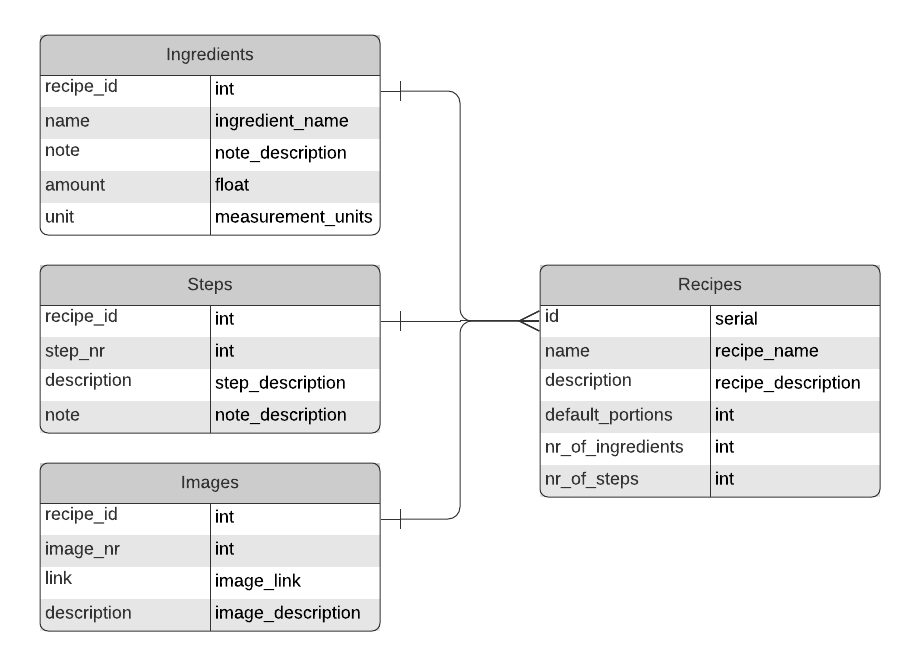

# matprat-website

# Website
The website is constructed with the w3.css framework and JavaScript for dynamically loading in information from the database.

# Server
The server runs on node.js with express.js to handle the API's. The server communicates with the database using the 'pg' package to connect to postgres.

## Database
The website information will be hosted in a PostgreSQL database. That means a good database design is crucial. The implementation of the database is found in the folder `sql`.
 
### Recipes Page
This is basic implementation of the content for the recipes page. A recipe is identified by a unique id and a unique name. Therefore, duplicate recipes are not possible. Due to this fact, all the other tables reference the recipes-table's `id` and `name`. This is how the website will identify which content belongs on the recipe site.

* **Ingredients** contains the ingredients, amount and unit to use in a recipe. The recipe-id combined with the name are unique identifiers meaning you can only list a certain ingredient-name once for a specific recipe. The amount can be any decimal number and the meaning of that number is specified in the *unit* column.

* **Steps** are the steps to take to complete a recipe. The recipe-id combined with the step-nr makes up a unique identifier so you can only have unique step numbers for each recipe. The description is what to do for this step and the note is an optional value that displays a small "note box" with information.

* **Images** are the image(s) that will be displayed on the bottom (or the top?) of the page. This table contains merely the links to where those images are. Like the other tables this also has a unique combination of recipe_id and image_nr. A description is added for information about the image and can typically be used in an "alt" tag.

### Domains and Enums

### Trigger Functions
